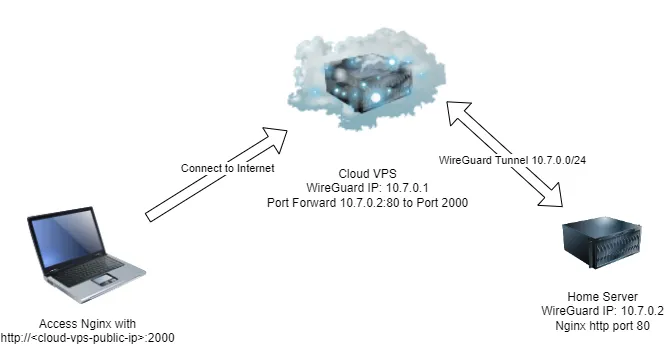
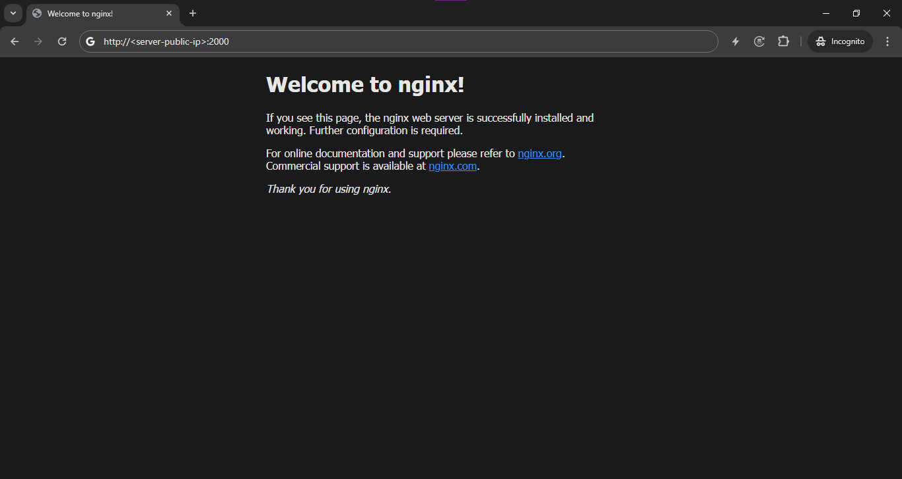

# Wireguard-Port-Forward

Publish Home Server with Help of Cloud VPS and WireGuard.

This tutorial will explain how to publish service such nginx from home server to public.

In this tutorial, the ufw is inactive and will use Ubuntu LTS >= 22.04 as both of OS.

The IP network address for WireGuard in this example is `10.7.0.0/24`.

The schematic of this configuration is below.



## Cloud VPS

1. Install WireGuard

   ```bash
   $ sudo apt install wireguard
   ```
2. Create the private key for WireGuard and change it's permissions

   ```bash
   $ wg genkey | sudo tee /etc/wireguard/private.key
   $ sudo chmod go= /etc/wireguard/private.key
   ```
3. Create the corresponding public key, which is derived from the private key.

   ```bash
   $ sudo cat /etc/wireguard/private.key | wg pubkey | sudo tee /etc/wireguard/public.key
   ```
4. Get IP route default interface (Needed for WireGuard config)

   ```bash
   $ ip route list default
   ```

   The output should look like this:

   ```bash
   default via 10.0.0.1 dev eth0 proto dhcp src 10.0.0.4 metric 100
   ```

   The interface to note is `eth0`.
5. Write to `/etc/wireguard/server-gateway.conf`

   ```
   [Interface]
   PrivateKey = # Get from /etc/wireguard/private.key
   Address = 10.7.0.1/24 # Choose Your Own Address
   ListenPort = 51820
   SaveConfig = false

   # Packet Forwarding
   PreUp = sysctl -w net.ipv4.ip_forward=1

   # Masquerade (Check Route Default Interface)
   PreUp = iptables -t nat -A POSTROUTING -o eth0 -j MASQUERADE
   PostDown = iptables -t nat -D POSTROUTING -o eth0 -j MASQUERADE
   ```
6. Check the config.

   > Up the interface
   >

   ```bash
   $ sudo wg-quick up server-gateway
   ```

   The output should look like this:

   ```bash
   [#] sysctl -w net.ipv4.ip_forward=1
   net.ipv4.ip_forward = 1
   [#] iptables -t nat -A POSTROUTING -o eth0 -j MASQUERADE
   [#] ip link add server-gateway type wireguard
   [#] wg setconf server-gateway /dev/fd/63
   [#] ip -4 address add 10.7.0.1/24 dev server-gateway
   [#] ip link set mtu 1420 up dev server-gateway
   ```

   > Check WireGuard interface
   >

   ```bash
   $ sudo wg show
   ```

   The output should look like this:

   ```bash
   public key: 9ZliFHj3pO0RrCDb/iVxORXgjAd6wrBPREKErGUioT4=
   private key: (hidden)
   listening port: 51820
   ```

   Note: The public key should be the same as `/etc/wireguard/public.key`.

   > Down the interface
   >

   ```bash
   $ sudo wg-quick down server-gateway
   ```

   The Output should look like this.

   ```bash
   [#] ip link delete dev server-gateway
   [#] iptables -t nat -D POSTROUTING -o eth0 -j MASQUERADE
   ```
7. Open port `51820/udp`

   It depends where the server is hosted.

## Home Server

1. Run step 1 - 3 from Cloud VPS section
2. Write to `/etc/wireguard/gateway-connect.conf`

   ```
   [Interface]
   PrivateKey = # Get from /etc/wireguard/private.key
   Address = 10.7.0.2/24
   SaveConfig = False
   Table = 123

   PreUp = ip rule add from 10.7.0.2 table 123 priority 456
   PostDown = ip rule del from 10.7.0.2 table 123 priority 456

   [Peer]
   PublicKey = # Get from server /etc/wireguard/public.key
   AllowedIPs = 0.0.0.0/0
   Endpoint = <server-public-ip>:51820
   ```

   > You need to get the peer public key from Cloud VPS public key. The config use Policy Routing with table `123`. You can look [this](https://www.procustodibus.com/blog/2022/09/wireguard-port-forward-from-internet/#policy-routing) for more details.
   >

## Final

1. Add peer details and port forwarding to `server-gateway.conf` from Cloud VPS

   ```
   [Interface]
   PrivateKey = # Get from /etc/wireguard/private.key
   Address = 10.7.0.1/24 # Choose Your Own Address
   ListenPort = 51820
   SaveConfig = false

   # Packet forwarding
   PreUp = sysctl -w net.ipv4.ip_forward=1

   # Masquerade (Check Route Default Interface)
   PreUp = iptables -t nat -A POSTROUTING -o eth0 -j MASQUERADE
   PostDown = iptables -t nat -D POSTROUTING -o eth0 -j MASQUERADE

   # Port Forwarding To Public IP (Example, Nginx from 10.7.0.2:80 to port 2000)
   PreUp = iptables -t nat -A PREROUTING -i eth0 -p tcp --dport 2000 -j DNAT --to-destination 10.7.0.2:80
   PostDown = iptables -t nat -D PREROUTING -i eth0 -p tcp --dport 2000 -j DNAT --to-destination 10.7.0.2:80

   # Remote settings for the peer
   [Peer]
   PublicKey = # Get from peer /etc/wireguard/public.key
   AllowedIPs = 10.7.0.2/32
   ```

   Take a look to this port forwarding section.

   ```json
   # Port Forwarding To Public IP (Example, Nginx from 10.7.0.2:80 to port 2000)
   PreUp = iptables -t nat -A PREROUTING -i eth0 -p tcp --dport 2000 -j DNAT --to-destination 10.7.0.2:80
   PostDown = iptables -t nat -D PREROUTING -i eth0 -p tcp --dport 2000 -j DNAT --to-destination 10.7.0.2:80
   ```

   > `10.7.0.2:80` is Home Server WireGuard IP Address, the port `:80` is the nginx http port. The `--dport 2000` is the destination port of the nginx http service. To access the nginx http service, the url will be `http://<server-public-ip>:2000`.
   >
2. Up the interface on both servers

   ```bash
   # Cloud VPS
   $ sudo wg-quick up server-gateway
   ```

   ```bash
   # Home Server
   $ sudo wg-quick up gateway-connect
   ```
3. Check if both Cloud VPS and Home Server are connected with `ping` and `curl`

   ```bash
   # Cloud VPS
   $ ping 10.7.0.2
   PING 10.7.0.2 (10.7.0.2) 56(84) bytes of data.
   64 bytes from 10.7.0.2: icmp_seq=1 ttl=64 time=19.2 ms
   64 bytes from 10.7.0.2: icmp_seq=2 ttl=64 time=19.5 ms
   64 bytes from 10.7.0.2: icmp_seq=3 ttl=64 time=20.0 ms
   ^C
   --- 10.7.0.2 ping statistics ---
   3 packets transmitted, 3 received, 0% packet loss, time 2003ms
   rtt min/avg/max/mdev = 19.171/19.548/19.993/0.338 ms

   $ curl http://10.7.0.2
   <!DOCTYPE html>
   <html>
   <head>
   <title>Welcome to nginx!</title>
   <style>
   html { color-scheme: light dark; }
   body { width: 35em; margin: 0 auto;
   font-family: Tahoma, Verdana, Arial, sans-serif; }
   </style>
   </head>
   <body>
   <h1>Welcome to nginx!</h1>
   <p>If you see this page, the nginx web server is successfully installed and
   working. Further configuration is required.</p>

   <p>For online documentation and support please refer to
   <a href="http://nginx.org/">nginx.org</a>.<br/>
   Commercial support is available at
   <a href="http://nginx.com/">nginx.com</a>.</p>

   <p><em>Thank you for using nginx.</em></p>
   </body>
   </html>
   ```

   ```bash
   $ ping 10.7.0.1
   PING 10.7.0.1 (10.7.0.1) 56(84) bytes of data.
   64 bytes from 10.7.0.1: icmp_seq=1 ttl=64 time=19.6 ms
   64 bytes from 10.7.0.1: icmp_seq=2 ttl=64 time=19.7 ms
   64 bytes from 10.7.0.1: icmp_seq=3 ttl=64 time=19.5 ms
   64 bytes from 10.7.0.1: icmp_seq=4 ttl=64 time=19.3 ms
   ^C
   --- 10.7.0.1 ping statistics ---
   4 packets transmitted, 4 received, 0% packet loss, time 3004ms
   rtt min/avg/max/mdev = 19.283/19.523/19.712/0.154 ms
   ```
4. Open port `2000/tcp` for the Cloud VPS
5. Check if port forwarding is working with web browser

   
6. Bonus, enable WireGuard interface from boot

   > Disable the interface first.
   >

   ```bash
   $ sudo wg-quick down <interface-name>
   ```

   > Enable with `systemctl`.
   >

   ```bash
   $ sudo systemctl enable --now wg-quick@<interface-name>.service
   ```

## Conclusions

With this method, you can publish service from Home Server to public with help of the Cloud VPS and WireGuard. Please note, in order for this to work the Cloud VPS ufw firewall needs to be inactive by default.
